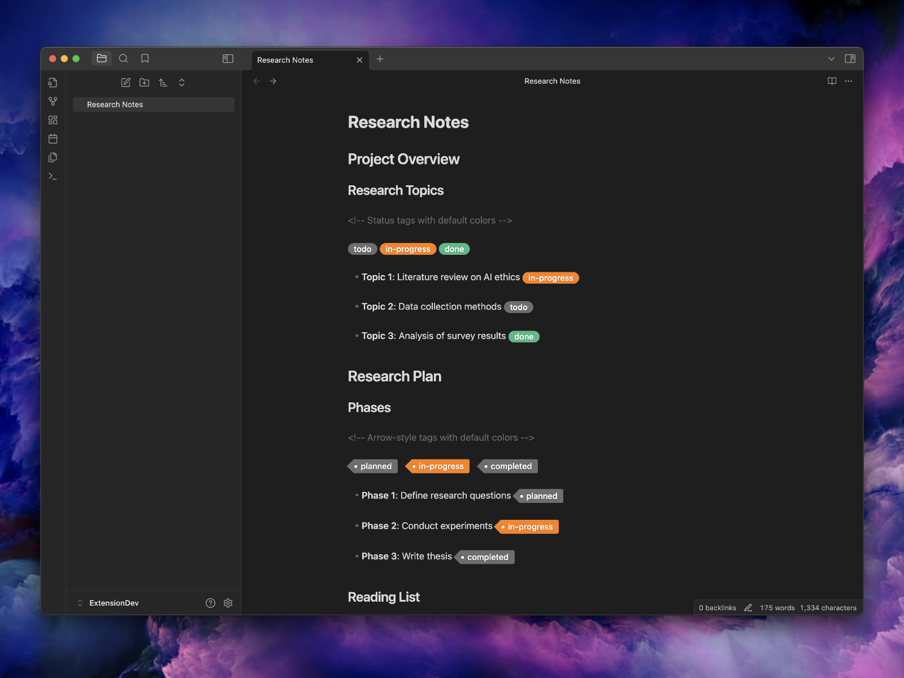

# Tags for Markdown: Enhanced Styled Labels for Obsidian

Add visual flair to your Markdown documents with custom tag styles! **Tags for Markdown** lets you highlight and style labels within Markdown documents using simple syntax and customizable colors—all within Obsidian. If you like **Tags for Markdown**, get our extension for [Visual Studio Code](https://github.com/binarynoir/vscode-markdown-tags/)!

[](https://buymeacoffee.com/binarynoir)
[](https://ko-fi.com/binarynoir)
[](https://binarynoir.tech)



## Features

### 🎨 Styled Tags

Highlight and style tags with ease using predefined or custom styles.

### 🖌️ Customizable Colors

Use semantic color names or create your own custom color classes through CSS for unlimited styling options.

### 📄 Flexible Syntax


Simple, clean syntax using `/` as separator:

```markdown
((tag/label))
((tag/label/color-name))
```

### 🌈 Supports a Variety of Colors

Choose from predefined colors (`grey`, `green`, `orange`, etc.) or use custom hex codes to suit your design preferences.

---

## Getting Started

1. **Install** the plugin from the Obsidian Community Plugins.
2. **Enable** the plugin in the Obsidian settings.
3. **Add Tags** in your Markdown files using the syntax below.

### Basic Syntax Examples

#### Status Tags

```markdown
((tag/todo)) ((tag/in-progress/warning)) ((tag/done/success))
```

#### Arrow-Style Tags (Using Custom CSS Class)

```markdown
((tag/planned/arrow)) ((tag/custom test/arrow))
```

#### Custom Color Classes

```markdown
((tag/Critical Task/critical)) ((tag/My Project/my-theme)) ((tag/Urgent/urgent))
```

---

## Tags and Colors

**Any label is now supported!** The plugin automatically converts your label into a CSS class name, allowing unlimited customization. Common legacy tags like **todo**, **planned**, **in-progress**, **doing**, **done**, **tip**, **on-hold**, **tbd**, **proposed**, **draft**, **wip**, **mvp**, **blocked**, **canceled**, **error**, **warning**, **warn** still work with predefined styling.

**Any color name is now supported!** Use semantic names like **success**, **warning**, **error**, **info**, **accent**, or create your own custom color classes. If no CSS exists for your color name, it will use the default theme styling.

See Examples Markdown Documents

### Tag Examples

#### Custom Labels (Any Text Supported)

- `((tag/My Custom Task/grey))`
- `((tag/Project Alpha/green))`
- `((tag/Bug Fix/red))`
- `((tag/Code Review/blue))`
- `((tag/Design Phase/purple))`

#### Legacy Tags (Predefined Styling)

- `((tag/todo/grey))` - Traditional task tag
- `((tag/in-progress/orange))` - Work in progress
- `((tag/done/green))` - Completed task
- `((tag/blocked/red))` - Blocked task

#### Predefined Color Examples

- `((tag/YOUR_LABEL/grey))`
- `((tag/YOUR_LABEL/green))`  
- `((tag/YOUR_LABEL/yellow))`
- `((tag/YOUR_LABEL/orange))`
- `((tag/YOUR_LABEL/blue))`
- `((tag/YOUR_LABEL/purple))`
- `((tag/YOUR_LABEL/red))`

#### Semantic Color Examples (New!)

- `((tag/Bug Report/critical))`
- `((tag/Security Issue/alert))`
- `((tag/Enhancement/success))`
- `((tag/Documentation/info))`
- `((tag/Needs Attention/warning))`
- `((tag/High Priority/urgent))`

> Replace `YOUR_LABEL` with any text and use any color name you want. Both labels and colors are automatically converted to valid CSS class names.

---

### Arrow-Style Tags (Using Custom CSS Class)

#### Custom Arrow Labels

- `((tag/Custom Arrow/arrow))`
- `((tag/Review Phase/arrow))`
- `((tag/Implementation/arrow))`
- `((tag/Testing Phase/arrow))`
- `((tag/Deployment/arrow))`

> Arrow tags work with any label by using the `arrow` color class and adding the corresponding CSS!

---

## Advanced Options

### CSS Integration

Since both labels and colors now become CSS classes, you have unlimited customization possibilities:

```css
/* Custom styling for specific labels */
.bn-tags.my-project {
    background-color: #ff6b35;
    border: 2px solid #ff4500;
}

.bn-tags.high-priority {
    background-color: #dc143c;
    font-weight: bold;
    animation: pulse 1s infinite;
}

/* Custom styling for semantic color names */
.bn-tags.critical {
    background-color: #dc2626;
    color: white;
    font-weight: bold;
}

.bn-tags.success {
    background-color: #16a34a;
    color: white;
}

.bn-tags.warning {
    background-color: #ea580c;
    color: white;
}

.bn-tags.info {
    background-color: #0284c7;
    color: white;
}

/* Example: Arrow-style tags using custom CSS class */
.bn-tags.arrow {
    all: unset;
    all: inherit;
    display: inline-block;
    height: 20px;
    line-height: 20px;
    right: -6px;
    position: relative;
    margin: 0 8px 0 10px;
    padding: 0 10px 0 12px;
    border-bottom-left-radius: 2px;
    border-top-left-radius: 2px;
    border-bottom-right-radius: 3px;
    border-top-right-radius: 3px;
    box-shadow: 0 1px 2px rgba(0, 0, 0, 0.2);
    color: white !important;
    font-size: 14px;
    font-weight: 500;
    text-decoration: none;
    text-shadow: 0 1px 2px rgba(0, 0, 0, 0.2);
    -webkit-text-fill-color: #ffffff !important;
    background-color: var(--color-l-gray-80);
}

.bn-tags.arrow:before {
    content: "";
    position: absolute;
    top: 0;
    left: -11px;
    width: 0;
    height: 0;
    border-color: transparent;
    border-radius: 15%;
    border-style: solid;
    border-width: 10px 12px 10px 0;
    border-right-color: var(--color-l-gray-80);
}

.bn-tags.arrow:after {
    content: "";
    position: absolute;
    top: 7.5px;
    left: .5px;
    float: left;
    width: 5px;
    height: 5px;
    border-radius: 50%;
    background: white;
    box-shadow: -1px -1px 2px rgba(0, 0, 0, 0.4);
}
```

Both labels and colors are automatically sanitized to valid CSS class names (spaces become hyphens, special characters are removed).

### Error Handling

The plugin defaults to `grey` when invalid colors are detected to ensure a consistent and polished look.

---

## How to install the plugin

- Download the [Latest release](https://github.com/binarynoir/obsidian-markdown-tags/releases/latest)
- Extract the `obsidian-markdown-tags` folder from the zip to your vault `<vault>/.obsidian/plugins/`

### Manually installing the plugin

Copy over main.js, styles.css, manifest.json to your vault VaultFolder/.obsidian/plugins/obsidian-markdown-tags/.

---

## Contributing

> Feel free to submit issues, feature requests, or contribute code on GitHub.

### Development

```bash
npm install
npm run build
cp main.js manifest.json /path/to/your/vault/.obsidian/plugins/obsidian-markdown-tags
```

### Release

### Releasing new releases

- Update the changelog with new features and fixes
- Commit all changed files and create a pull request
- Update the `manifest.json` with the new version number, such as `1.0.1`, and the minimum Obsidian version required for your latest release.
- Update the `versions.json` file with `"new-plugin-version": "minimum-obsidian-version"` so older versions of Obsidian can download an older version of your plugin that's compatible.
- Create new GitHub release using the new version number as the "Tag version". Use the exact version number, don't include a prefix `v`. See here for an example: https://github.com/obsidianmd/obsidian-sample-plugin/releases
- Upload the files `manifest.json`, `main.js`, `styles.css` as binary attachments. Note: The manifest.json file must be in two places, first the root path of your repository and also in the release.
- Publish the release.

> You can simplify the version bump process by running `npm version patch`, `npm version minor` or `npm version major` after updating `minAppVersion` manually in `manifest.json`.
> The command will bump version in `manifest.json` and `package.json`, and add the entry for the new version to `versions.json`

```bash
git checkout main
git pull
git tag -a x.y.z -m "x.y.z"
git push --tags
```

The release will automatically be drafted.

## License

MIT License

---

## Support

If you encounter any issues or have questions, please open an issue on GitHub.

## Author

John Smith III

## Acknowledgments

Thanks to all contributors and users for their support and feedback.
